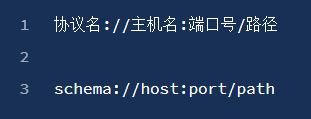

# HTML&&CSS基本介绍

1. web : 互联网
2. w3c:万维网联盟，非盈利性的组织：w3.org 为互联网提供各种标准。
3. XML 可扩展的标记语言：extension markup language，用于定义文档结构的。

```xml
<任务>
    <执行日期> 每周一 </执行日期>
    <执行时间> 下午两点 </执行时间>
    <下载地址> 人人网 </下载地址>
    <下载目标> 最新版《权力的游戏》 </下载目标>
</任务>
```

## 什么是 HTML？

HTML 是 W3C 组织定义的语言标准：HTML 是用于描述页面结构的语言。

结构：有什么东西，该东西表示什么含义

HTML：Hyper Text Markup Language，超文本标记语言。

书写一个一级标题：`<h1> 一级标题 </h1>`

MDN ：Mozilla Development Network，Mozilla 开发者社区。

CSS : 是 W3C 定义的语言标准：CSS 是用于描述页面展示的语言 ，CSS 决定了页面长什么样子。

## 执行 HTML CSS

HTML 、CSS --> 浏览器内核 - -> 页面

浏览器：

1. shell：外壳
2. core：内核（JS 执行引擎、渲染引擎）

IE : Trident            Firfox : Gecko                Chrome : Webkit / Blink     Safari : Webkit             Opera : Presto / Blink

## 注释

注释为代码的阅读者提供帮助，注释不参与运行

在HTML中，注释使用如下格式书写：`<!-- 注释内容 -->`

## 元素

> 其他叫法：标签、标记

```html
<a href="http://www.duyiedu.com" title="黑龙江渡一教育有限公司">渡一教育</a>
<title>Document</title>
```
整体：element （元素）
元素 = 起始标记（begin tag） + 结束标记（end tag） + 元素内容 + 元素属性
属性 = 属性名 + 属性值

属性的分类：

- 局部属性：某些元素特有的属性
- 全局属性：所有元素通用


```html
<meta charset="UTF-8">
```

有些元素没有结束标记，这样的元素叫做：**空元素**

空元素的两种写法：

- ````html
  <meta charset="UTF-8">
  ```
- `<meta charset="UTF-8" />`

## 元素的嵌套

元素不能相互嵌套

父元素、子元素、祖先元素、后代元素、兄弟元素（拥有同一个父元素的两个元素）

## 标准的文档结构

HTML：页面、HTML文档 `<!DOCTYPE html>`文档声明，告诉浏览器，当前文档使用的HTML标准是HTML5。不写文档声明，将导致浏览器进入怪异渲染模式。

`<html lang="en"></html>` : 根元素，一个页面最多只能一个，并且该元素是所有其他元素的父元素或祖先元素。HTML5版本中没有强制要求书写该元素

lang属性：language，全局属性，表示该元素内部使用的文字是使用哪一种自然语言书写而成的。

`<head></head>`: 文档头，文档头内部的内容，不会显示到页面上。

`<meta>`:文档的元数据：附加信息。

 charset：指定网页内容编码。

UTF-8 是 Unicode 编码的一个版本

`<title>Document</title>`：网页标题

`<body>   </body>：`文档体，页面上所有要参与显示的元素，都应该放置到文档体中。

# 语义化

## 什么是语义化

1. 每一个HTML元素都有具体的含义

	- a元素：超链接
	- p元素：段落
	- h1元素：一级标题

2. 所有元素与展示效果无关

   - 元素展示到页面中的效果，应该由CSS决定
   - 因为浏览器带有默认的CSS样式，所以每个元素有一些默认样式。

==**重要：选择什么元素，取决于内容的含义，而不是显示出的效果**==

## 为什么需要语义化？

1. 为了搜索引擎优化（SEO）

   - 搜索引擎：百度、搜搜、Bing、Google

   - 每隔一段时间，搜索引擎会从整个互联网中，抓取页面源代码

2. 为了让浏览器理解网页

   - 阅读模式、语音模式

# 文本元素

HTML5中支持的元素：HTML5元素周期表

## h

标题：head

h1~h6：表示1级标题~6级标题

## p

段落，paragraphs

> lorem，乱数假文，没有任何实际含义的文字

## span【无语义】

没有语义，仅用于设置样式

> 以前：某些元素在显示时会独占一行（块级元素），而某些元素不会（行级元素）
> 到了HTML5，已经弃用这种说法。

## pre

预格式化文本元素

空白折叠：在源代码中的连续空白字符（空格、换行、制表），在页面显示时，会被折叠为一个空格

例外：在pre元素中的内容不会出现空白折叠

在pre元素内部出现的内容，会按照源代码格式显示到页面上，该元素通常用于在网页中显示一些代码。

pre元素功能的本质：它有一个默认的css属性

> 显示代码时，通常外面套code元素，code表示代码区域。

# HTML实体

实体字符， HTML Entity

实体字符通常用于在页面中显示一些特殊符号。

&单词;  &#数字;

- 小于符号:`&lt;`
- 大于符号:`&gt;`
- 空格符号:`&nbsp;`
- 版权符号:`&copy;`
- &符号:`&amp;`

# a元素

a元素：表示超链接

## href属性

hyper reference：通常表示跳转地址

1. 普通链接
2. 锚链接：id属性：全局属性，表示元素在文档中的唯一编号

3. 功能链接：点击后，触发某个功能

	- 执行JS代码，javascript:
	- 发送邮件，mailto:要求用户计算机上安装有邮件发送软件：exchange
	- 拨号，tel:  要求用户计算机上安装有拨号软件，或使用的是移动端访问

## target属性

target属性：表示跳转窗口位置。

target的取值：

- _self：在当前页面窗口中打开，默认值
- _blank: 在新窗口中打开

# 路径的写法

## 站内资源和站外资源

站内资源：当前网站的资源

站外资源：非当前网站的资源

## 绝对路径和相对路径

站外资源：绝对路径

站内资源：相对路径

1. 绝对路径

   - 绝对路径的书写格式：

   - url地址：
    - 当跳转目标和当前页面的协议相同时，可以省略协议

2. 相对路径

	- 以./开头，./表示当前资源所在的目录

	- 可以书写../表示返回上一级目录

	- 相对路径中：./可以省略

# 图片元素

## img元素

image缩写，空元素

src属性：source

alt属性：当图片资源失效时，将使用该属性的文字替代图片

## 和a元素联用

## 和map元素

map：地图

map的子元素：area

衡量坐标时，为了避免衡量误差，需要使用专业的衡量工具：

ps、pxcook、cutpro（本人开发）

## 和figure元素

指代、定义，通常用于把图片、图片标题、描述包裹起来

子元素：figcaption

# 多媒体元素

video 视频                   audio 音频

## video

controls: 控制控件的显示，取值只能为controls

某些属性，只有两种状态：1. 不写   2. 取值为属性名，这种属性叫做布尔属性

布尔属性，在HTML5中，可以不用书写属性值

autoplay: 布尔属性，自动播放。

muted: 布尔属性，静音播放。

loop: 布尔属性，循环播放

## audio

和视频完全一致


## 兼容性

1. 旧版本的浏览器不支持这两个元素
2. 不同的浏览器支持的音视频格式可能不一致

   mp4、webm
   
# 列表元素

## 有序列表

- ol: ordered list

- li：list item 

## 无序列表

把ol改成ul

ul：unordered list

无序列表常用于制作菜单 或 新闻列表。

## 定义列表

通常用于一些术语的定义

- dl: definition list

- dt: definition title

- dd: definition description

# 容器元素

容器元素：该元素代表一个块区域，内部用于放置其他元素

## div元素

没有语义

## 语义化容器元素

- header: 通常用于表示页头，也可以用于表示文章的头部

- footer: 通常用于表示页脚，也可以用于表示文章的尾部

- article: 通常用于表示整篇文章

- section: 通常用于表示文章的章节

- aside: 通常用于表示侧边栏

# 元素包含关系

以前：块级元素可以包含行级元素，行级元素不可以包含块级元素，a元素除外

元素的包含关系由元素的内容类别决定。

例如，查看h1元素中是否可以包含p元素

总结：

1. 容器元素中可以包含任何元素
2. a元素中几乎可以包含任何元素
3. 某些元素有固定的子元素（`ul>li，ol>li，dl>dt+dd`）
4. 标题元素和段落元素不能相互嵌套，并且不能包含容器元素


# 表单元素

一系列元素，主要用于收集用户数据

## input元素

输入框

- type属性：输入框类型

  - type: text， 普通文本输入框
  - type：password，密码框
  - type: date, 日期选择框，兼容性问题
  - type: search, 搜索框，兼容性问题
  - type: number，数字输入框
  - type: checkbox，多选框
  - type: radio，单选框
- value属性：输入框的值
- placeholder属性：显示提示的文本，文本框没有内容时显示


input元素可以制作按钮

- 当type值为reset、button、submit时，input表示按钮。


## select元素

下拉列表选择框

- 通常和option元素配合使用

## textarea元素

文本域，多行文本框

## 按钮元素

button

type属性：reset、submit、button，默认值submit

## 表单状态

readonly属性：布尔属性，是否只读，不会改变表单显示样式

disabled属性：布尔属性，是否禁用，会改变表单显示样式

## 配合表单元素的其他元素

### label

普通元素，通常配合单选和多选框使用

- 显示关联

可以通过for属性，让label元素关联某一个表单元素，for属性书写表单元素id的值

- 隐式关联

### datalist

数据列表

该元素本身不会显示到页面，通常用于和普通文本框配合

### form元素

通常，会将整个表单元素，放置form元素的内部，作用是当提交表单时，会将form元素内部的表单内容以合适的方式提交到服务器。

form元素对开发静态页面没有什么意义。

### fieldset元素

表单分组

# 美化表单元素

## 新的伪类

1. focus：元素聚焦时的样式

2. checked：单选或多选框被选中的样式

## 常见用法

1. 重置表单元素样式

2. 设置textarea是否允许调整尺寸

css属性resize：

- both：默认值，两个方向都可以调整尺寸
- none：不能调整尺寸
- horizontal: 水平方向可以调整尺寸
- vertical：垂直方向可以调整尺寸

3. 文本框边缘到内容的距离

4. 控制单选和多选的样式

# 表格元素

在css技术出现之前，网页通常使用表格布局。

后台管理系统中可能会使用表格。

- 前台：面向用户


- 后台：面向管理员。对界面要求不高，对功能性要求高。


表格不再适用于网页布局？表格的渲染速度过慢。


# 其他元素

1. abbr：缩写词

2. time：提供给浏览器或搜索引擎阅读的时间

3. b  （bold）：以前是一个无语义元素，主要用于加粗字体

4. q：一小段引用文本

5. blockquote：大段引用的文本

6. br：无语义，主要用于在文本中换行

7. hr：无语义，主要用于分割

8. meta：还可以用于搜索引擎优化（SEO）

9. link：链接外部资源（CSS、图标）

   - rel属性：relation，链接的资源和当前网页的关系

   - type属性：链接的资源的MIME类型

# @规则

at-rule: @规则、@语句、CSS语句、CSS指令

1. import

   - `import "路径"`;

   - 导入另外一个css文件

2. charset

   - `@charset "utf-8";`

   - 告诉浏览器该CSS文件，使用的字符编码集是utf-8，必须写到第一行

# web字体和图标

## web字体

​	用户电脑上没有安装相应字体，强制让用户下载该字体

​	使用@font-face指令制作一个新字体

## 字体图标

​	iconfont.cn


# 布局

## 多栏布局

- 两栏布局

  ```html
  <!DOCTYPE html>
  <html lang="en">
    <head>
      <meta charset="UTF-8" />
      <meta name="viewport" content="width=device-width, initial-scale=1.0" />
      <meta http-equiv="X-UA-Compatible" content="ie=edge" />
      <title>Document</title>
      <style>
        .clearfix::after {
          content: "";
          display: block;
          clear: both;
        }
        .container {
          background: lightblue;
          width: 90%;
          margin: 0 auto;
        }
        .aside {
          float: left;
          background: #008c8c;
          color: #fff;
          width: 300px;
          margin-right: 30px;
        }
  
        .main {
          overflow: hidden;
          background: gray;
        }
      </style>
    </head>
    <body>
      <div class="container clearfix">
        <aside class="aside">
          Lorem ipsum dolor sit amet consectetur adipisicing elit. Voluptatibus
        </aside>
        <div class="main">
          asperiores, odio iusto obcaecati voluptate, quisquam sit vel mollitia
        </div>
      </div>
    </body>
  </html>
  
  ```

- 三栏布局

  ```html
  <!DOCTYPE html>
  <html lang="en">
    <head>
      <meta charset="UTF-8" />
      <meta name="viewport" content="width=device-width, initial-scale=1.0" />
      <meta http-equiv="X-UA-Compatible" content="ie=edge" />
      <title>Document</title>
      <style>
        .clearfix::after {
          content: "";
          display: block;
          clear: both;
        }
        .container {
          padding: 30px;
          border: 3px solid;
        }
        .left {
          float: left;
          width: 300px;
          background: lightblue;
          margin-right: 20px;
        }
        .right {
          float: right;
          width: 300px;
          background: lightblue;
          margin-left: 20px;
        }
        .main {
          overflow: hidden;
          border: 2px solid;
        }
      </style>
    </head>
    <body>
      <div class="container clearfix">
        <aside class="left">
          Necessitatibus deserunt impedit totam dolore quaerat molestias
          cupiditate. Laborum, temporibus.
        </aside>
  
        <aside class="right">
          voluptates vero, delectus commodi qui, eos quia quasi quisquam ratione
          porro. Nobis exercitationem voluptate libero, delectus perferendis et.
        </aside>
  
        <div class="main">
          officia nostrum, ex nemo laborum aperiam sunt corporis, reprehenderit
          quasi. Odit neque iusto ea ducimus obcaecati. Illo nam, blanditiis nisi
          maiores aspernatur vel. Reiciendis expedita vitae necessitatibus quos.
        </div>
      </div>
    </body>
  </html>
  
  ```

  

## 等高

1. CSS3的弹性盒
2. JS控制
3. 伪等高

## 元素书写顺序

## 后台页面的布局

```html
<!DOCTYPE html>
<html lang="en">
  <head>
    <meta charset="UTF-8" />
    <meta name="viewport" content="width=device-width, initial-scale=1.0" />
    <meta http-equiv="X-UA-Compatible" content="ie=edge" />
    <title>Document</title>
    <style>
      body {
        margin: 0;
      }

      h1 {
        margin: 0;
      }

      .app {
        position: fixed;
        width: 100%;
        height: 100%;
      }

      .header {
        height: 60px;
        background: #000;
        color: #fff;
        position: absolute;
        left: 0;
        top: 0;
        width: 100%;
      }

      .container {
        width: 100%;
        height: 100%;
        background: lightblue;
        padding-top: 60px;
        box-sizing: border-box;
      }

      .container .left {
        float: left;
        width: 300px;
        background: rgb(119, 119, 119);
        color: #fff;
        height: 100%;
        padding: 20px;
        box-sizing: border-box;
        overflow: auto;
      }

      .container .main {
        overflow: hidden;
        height: 100%;
        background: #fff;
        padding: 20px;
        box-sizing: border-box;
        overflow: auto;
      }
    </style>
  </head>

  <body>
    <div class="app">
      <header class="header">
        <h1>的撒按时打发十分阿斯蒂发</h1>
      </header>
      <div class="container">
        <aside class="left">
          suscipit. Officiis quos corrupti, nobis provident odio alias quo
        </aside>
        <div class="main">
          suscipit. Officiis quos corrupti, nobis provident odio alias quo
          sequi, culpa perferendis, quod voluptatibus. Tenetur ad praesentium
          eos nemo, quis sapiente labore!
        </div>
      </div>
    </div>
  </body>
</html>
```

# 行高的取值

line-height

1. px, 像素值

2. 无单位的数字

3. em单位

4. 百分比

# body背景

**画布 canvas**

一块区域

特点：

1. 最小宽度为视口宽度
2. 最小高度为视口高度

**HTML元素的背景**

- 覆盖画布

**BODY元素的背景**

- 如果HTML元素有背景，BODY元素正常（背景覆盖边框盒）
- 如果HTML元素没有背景，BODY元素的背景覆盖画布

**关于画布背景图**

1. 背景图的宽度百分比，相对于视口
2. 背景图的高度百分比，相对于网页高度
3. 背景图的横向位置百分比、预设值，相对于视口
4. 背景图的纵向位置百分比、预设值，相对于网页高度


# 行盒的垂直对齐

## 多个行盒垂直方向上的对齐

给没有对齐元素设置vertical-align

- 预设值


- 数值


## 图片的底部白边

图片的父元素是一个块盒，块盒高度自动，图片底部和父元素底边之间往往会出现空白。

1. 设置父元素的字体大小为0
2. 将图片设置为块盒


# 参考线-深入理解字体

font-size、line-height、vertical-align、font-family

## 文字

文字是通过一些文字制作软件制作的，比如fontforge

制作文字时，会有几根参考线，不同的文字类型，参考线不一样。同一种文字类型，参考线一致。

## font-size

字体大小，设置的是文字的相对大小

文字的相对大小：1000、2048、1024

文字顶线到底线的距离，是文字的实际大小（content-area，内容区）

行盒的背景，覆盖content-area

## 行高

顶线向上延申的空间，和底线向下延申的空间，两个空间相等，该空间叫做gap（空隙）

gap默认情况下，是字体设计者决定

top到botoom（看ppt图），叫做virtual-area（虚拟区）

行高，就是virtual-area

line-height:normal，默认值，使用文字默认的gap

> 文字一定出现一行的最中间——错误
> content-area一定出现在virtual-area的中间

## vertical-align

- 决定参考线：font-size、font-family、line-height

- 一个元素如果子元素出现行盒，该元素内部也会产生参考线 
- baseline：该元素的基线与父元素的基线对齐

- super: 该元素的基线与父元素的上基线对齐

- sub：该元素的基线与父元素的下基线对齐

- text-top: 该元素的virtual-area的顶边，对齐父元素的text-top

- text-bottom: 该元素的virtual-area的底边，对齐父元素的text-bottom

- top：该元素的virtual-area的定边，对齐line-box的顶边

- bottom：该元素的virtual-area的底边，对齐line-box的底边

- middle: 该元素的中线（content-area的一半），与父元素的X字母高度一半的位置对齐

- 行盒组合起来，可以形成多行，每一行的区域叫做line-box，line-box的顶边是该行内所有行盒最高顶边，底边是该行行盒的最低底边。

- 实际，一个元素的实际占用高度（高度自动），高度的计算通过line-box计算。
  - 行盒：inline-box
  - 行框：line-box

- 数值：相对于基线的偏移量，向上为正数，向下为负数。

- 百分比：相对于基线的偏移量，百分比是相对于自身virtual-area的高度

- line-box是承载文字内容的必要条件，以下情况不生成行框：

  - 某元素内部没有任何行盒
  - 某元素字体大小为0

## 可替换元素和行块盒的基线

图片：基线位置位于图片的下外边距。

表单元素：基线位置在内容底边

行块盒：

- 行块盒最后一行有line-box，用最后一行的基线作为整个行块盒的基线。
- 如果行块盒内部没有行盒，则使用下外边距作为基线

# 堆叠上下文

堆叠上下文（stack context），它是一块区域，这块区域由某个元素创建，它规定了该区域中的内容在Z轴上排列的先后顺序。

## 创建堆叠上下文的元素

1. html元素（根元素）
2. 设置了z-index（非auto）数值的定位元素

## 同一个堆叠上下文中元素在Z轴上的排列

从后到前的排列顺序：

1. 创建堆叠上下文的元素的背景和边框
2. 堆叠级别(z-index, stack level)为负值的堆叠上下文
3. 常规流非定位的块盒
4. 非定位的浮动盒子
5. 常规流非定位行盒
6. 任何 z-index 是 auto 的定位子元素，以及 z-index 是 0 的堆叠上下文
7. 堆叠级别为正值的堆叠上下文

每个堆叠上下文，独立于其他堆叠上下文，它们之间不能相互穿插。

# svg

svg: scalable vector graphics，可缩放的矢量图

1. 该图片使用代码书写而成
2. 缩放不会失真
3. 内容轻量

## 怎么使用

svg可以嵌入浏览器，也可以单独成为一个文件

xml语言，svg使用该语言定义

## 书写svg代码

### 矩形:rect

### 圆形：circle

### 椭圆：ellipse

### 线条：line

### 折线：polyline

### 多边形：polygon

### 路径：path

M = moveto
L = lineto
H = horizontal lineto
V = vertical lineto
C = curveto
S = smooth curveto
Q = quadratic Belzier curve
T = smooth quadratic Belzier curveto
A = elliptical Arc

A
半径1    
半径2     
顺时针旋转角度    
小弧（0）或大弧（1）   
顺时针（1）逆时针（0）

Z = closepath


### 例子

画太极图

```html
<svg xmlns="http://www.w3.org/2000/svg" width="500" height="500" style="background:#ccc">
    <path fill="#000" d="M250 50 A100 100 0 0 1 250 250 A100 100 0 0 0 250 450 A200 200 0 0 1 250 50"/>
    <path fill="#fff" d="M250 50 A100 100 0 0 1 250 250 A100 100 0 0 0 250 450 A200 200 0 0 0 250 50"/>
    <circle cx="250" cy="150" r="30" fill="#fff"/>
    <circle cx="250" cy="350" r="30" fill="#000"/>
</svg>
```

# 数据链接

data url

## 如何书写

​	数据链接：将目标文件的数据直接书写到路径位置

​	语法：data:MIME,数据

## 意义

优点：

1. 减少了浏览器中的请求

   - 请求

   - 响应

   - 减少了请求中浪费的时间

2. 有利于动态生成数据

缺点：

1. 增加了资源的体积

   - 导致了传输内容增加，从而增加了单个资源的传输时间
2. 不利于浏览器的缓存
   - 浏览器通常会缓存图片文件、css文件、js文件。
3. 会增加原资源的体积到原来的4/3

应用场景：

1. 但请求单个图片体积较小，并且该图片因为各种原因，不适合制作雪碧图，可以使用数据链接。

2. 图片由其他代码动态生成，并且图片较小，可以使用数据链接。

## base64

一种编码方式

- 通常用于将一些二进制数据，用一个可书写的字符串表示。

# 浏览器兼容性

## 问题产生原因

- 市场竞争
- 标准版本的变化

## 厂商前缀

> 比如：box-sizing， 谷歌旧版本浏览器中使用-webkit-box-sizing:border-box

- 市场竞争，标准没有发布
- 标准仍在讨论中（草案），浏览器厂商希望先支持

IE： -ms-
Chrome，safari:  -webkit-
opera： -o-
firefox: -moz-

> 浏览器在处理样式或元素时，使用如下的方式：
> 当遇到无法识别的代码时，直接略过。


1. 谷歌浏览器的滚动条样式

   - 实际上，在开发中使用自定义的滚动条，往往是使用div+css+JS实现的
2. 多个背景图中选一个作为背景

## css hack

根据不同的浏览器（主要针对IE），设置不同的样式和元素

1. 样式

IE中，CSS的特殊符号

- *属性，兼容IE5、IE6、IE7
- _属性，兼容IE5~IE6
- 属性值\9，兼容IE5~IE11
- 属性值\0，兼容IE8~IE11
- 属性值\9\0，兼容IE9~IE10

> IE5、6、7的外边距bug，浮动元素的左外边距翻倍

2. 条件判断

## 渐近增强 和 优雅降级

两种解决兼容性问题的思路，会影响代码的书写风格

- 渐近增强：先适应大部分浏览器，然后针对新版本浏览器加入新的样式

书写代码时，先尽量避免书写有兼容性问题的代码，完成之后，再逐步加入新标准中的代码。

- 优雅降级：先制作完整的功能，然后针对低版本浏览器进行特殊处理

书写代码时，先不用特别在意兼容性，完成整个功能之后，再针对低版本浏览器处理样式。

## caniuse

查找css兼容性:[caniuse.com](https://caniuse.com/)

# 居中总结

居中：盒子在其包含块中居中

## 行盒（行块盒）水平居中

​	直接设置行盒（行块盒）父元素```text-align:center```

## 常规流块盒水平居中

​	定宽，设置左右margin为auto

```html
<!DOCTYPE html>
<html lang="en">
  <head>
    <meta charset="UTF-8" />
    <meta name="viewport" content="width=device-width, initial-scale=1.0" />
    <meta http-equiv="X-UA-Compatible" content="ie=edge" />
    <title>Document</title>
    <style>
      .container {
        margin: 30px;
        height: 200px;
        background: lightblue;
      }
      p {
        width: 500px;
        height: 100px;
        background: red;
        margin: 0 auto;
      }
    </style>
  </head>
  <body>
    <div class="container">
      <p></p>
    </div>
  </body>
</html>
```

## 绝对定位元素的水平居中

​	定宽，设置左右的坐标为0（left:0, right:0），将左右margin设置为auto

> 实际上，固定定位（fixed）是绝对定位（absolute）的特殊情况

```html
<!DOCTYPE html>
<html lang="en">
  <head>
    <meta charset="UTF-8" />
    <meta name="viewport" content="width=device-width, initial-scale=1.0" />
    <meta http-equiv="X-UA-Compatible" content="ie=edge" />
    <title>Document</title>
    <style>
      .container {
        margin: 30px;
        height: 200px;
        background: lightblue;
        position: relative;
      }
      p {
        width: 500px;
        height: 100px;
        background: red;
        margin: 0 auto;
        position: absolute;
        left: 0;
        right: 0;
        margin: 0 auto;
      }
    </style>
  </head>
  <body>
    <div class="container">
      <p></p>
    </div>
  </body>
</html>
```


## 单行文本的垂直居中

​	设置文本所在元素的行高，为整个区域的高度

```html
<!DOCTYPE html>
<html lang="en">
  <head>
    <meta charset="UTF-8" />
    <meta name="viewport" content="width=device-width, initial-scale=1.0" />
    <meta http-equiv="X-UA-Compatible" content="ie=edge" />
    <title>Document</title>
    <style>
      h1 {
        height: 200px;
        background: lightblue;
        text-align: center;
        line-height: 200px;
      }
    </style>
  </head>
  <body>
    <h1>标题</h1>
  </body>
</html>
```


## 行块盒或块盒内多行文本的垂直居中

​	没有完美方案

​	设置盒子上下内边距相同，达到类似的效果。

```html
<!DOCTYPE html>
<html lang="en">
  <head>
    <meta charset="UTF-8" />
    <meta name="viewport" content="width=device-width, initial-scale=1.0" />
    <meta http-equiv="X-UA-Compatible" content="ie=edge" />
    <title>Document</title>
    <style>
      div {
        background: lightblue;
        /* display: inline-block; */
        padding: 100px 0;
      }
    </style>
  </head>
  <body>
    <div>
      Lorem ipsum dolor sit, amet consectetur adipisicing elit. Repudiandae
      cupiditate distinctio suscipit nihil sed incidunt, provident, laboriosam
      rem ad repellat excepturi officiis sapiente enim fuga similique quas, vero
      dolores quae!
    </div>
  </body>
</html>

```

## 绝对定位的垂直居中

​	定高，设置上下的坐标为0（top:0, bottom:0），将上下margin设置为auto

```html
<!DOCTYPE html>
<html lang="en">
  <head>
    <meta charset="UTF-8" />
    <meta name="viewport" content="width=device-width, initial-scale=1.0" />
    <meta http-equiv="X-UA-Compatible" content="ie=edge" />
    <title>Document</title>
    <style>
      .container {
        margin: 30px;
        height: 200px;
        background: lightblue;
        position: relative;
      }
      p {
        width: 500px;
        height: 100px;
        background: red;
        margin: 0 auto;
        position: absolute;
        top: 0;
        bottom: 0;
        margin: auto 0;
      }
    </style>
  </head>
  <body>
    <div class="container">
      <p></p>
    </div>
  </body>
</html>
```

# 样式补充

## display:list-item

设置为该属性值的盒子，本质上仍然是一个块盒，但同时该盒子会附带另一个盒子

元素本身生成的盒子叫做主盒子，附带的盒子称为次盒子，次盒子和主盒子水平排列

涉及的css：

1. ```list-style-type```

   - 设置次盒子中内容的类型
2. ```list-style-position```
   - 设置次盒子相对于主盒子的位置
3. 速写属性```list-style```

**清空次盒子**

list-style:none

## 图片失效时的宽高问题

如果img元素的图片链接无效，img元素的特性和普通行盒一样，无法设置宽高

## 行盒中包含行块盒或可替换元素

行盒的高度与它内部的行块盒或可替换元素的高度无关

## text-align:justify

text-align:

- left: 左对齐
- right：右对齐
- center：居中
- justify：除最后一行外，分散对齐

## 制作一个三角形

```html
<!DOCTYPE html>
<html lang="en">
  <head>
    <meta charset="UTF-8" />
    <meta name="viewport" content="width=device-width, initial-scale=1.0" />
    <meta http-equiv="X-UA-Compatible" content="ie=edge" />
    <title>Document</title>
    <style>
      div {
        width: 0;
        height: 0;
        border: 10px solid transparent;
        border-left-color: red;
      }
    </style>
  </head>
  <body>
    <div></div>
  </body>
</html>
```

## direction 和 writing-mode

开始 start -> 结束 end
左 left -> 右 end

开始和结束是相对的，不同国家有不同的习惯

左右是绝对的

direction设置的是开始到结束的方向

writing-mode：设置文字书写方向

## utf-8字符
