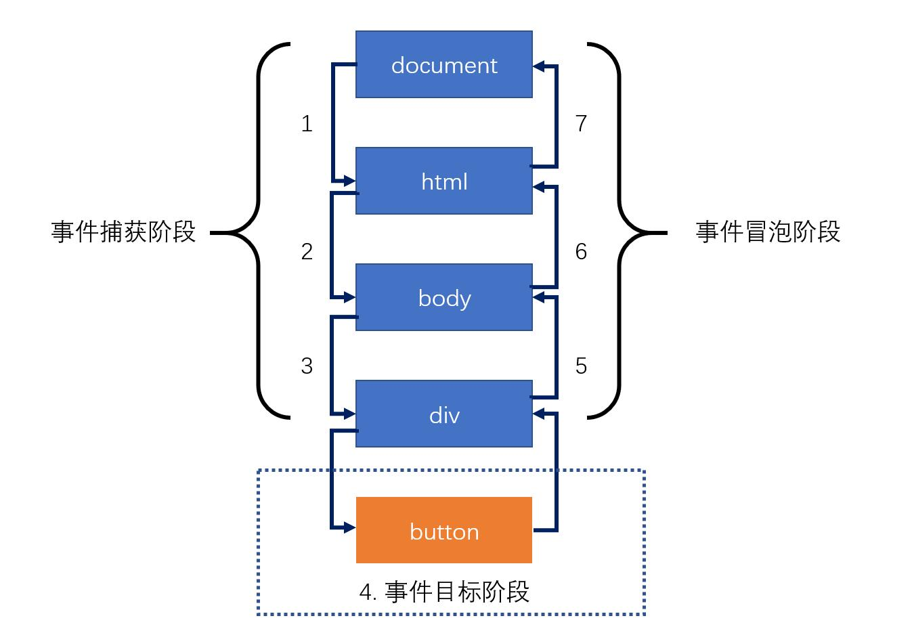

# JS语言概述

## JS语言简史

1. JS语言的起源

   网景（Netscape Communication Corperation），1994年，推出第一款商用浏览器，网景浏览器（Netscape Navigator）

   1995年，网景公司决定在浏览器中加入一门语言，可以作交互效果，提高用户体验。

   最终决定独立开发一门新的语言，聘请Brendan Eich，10天后，新的语言诞生

   LiveScript -> JavaScript (JS)

   **JS语言之父：Brendan Eich**

2. 第一次浏览器大战

   网景公司打算在浏览器中加入网络操作系统，影响到微软的利益，引起了微软的注意

   1995年，微软发布IE浏览器。

   JS语言推出之后，网景获得极大的竞争优势。

   微软对JS语言反编译，借鉴JS语言，退出了JScript、VBScript

   第一次浏览器大战是标准之争

   1997，网景公司将javascript1.1版本提交给ECMA（欧洲计算机制造协会）

   IE3发布，并绑定windows操作系统。

   1998年，网景公司，被收购。

   **ECMA收录了JavaScript，并提交给ISO，经过修改，成为了第一个JS的标准版本，成为ECMAScript，简称ES**

3. 第二次浏览器大战

   IE4、IE5、IE6（windows xp）

   微软决定解散浏览器团队。

   Brendan Eich，带领团队成立Mozilla基金会，并决定，将网景浏览器开源。

   长时间内，世界的技术爱好者，对网景浏览器，进行维护和打补丁

   2002，Mozilla推出firefox浏览器。

   2008，谷歌推出chrome浏览器，苹果推出safari，ASA公司推出opera

   chrome浏览器搭载JS执行引擎V8（V8引擎，可以将JS代码直接转换为字节码，理论上，JS代码的执行速度已经接近汇编语言）

   于是，JS具备了编写大型应用程序的能力，甚至服务器应用

    > Ryan Dahl 准备写一个服务器端的框架，直接利用V8引擎完成了该框架，该框架，称为nodejs

    **V8，将JS的执行推向了一个新的台阶**

4. ES标准的发展

   ES1，1997年
   ES2，1998年
   ES3，1999年
   ES5，2009年，习惯上，不再区分 javascript （JS） 和 ECMAScript （ES）
   ES6，2015年，ECMA宣布，从ES6开始，使用年号作为版本号，ES6的真正称呼为：ES2015
   ES7，2016年，ES2016

**非常重要：ES制定语言标准，不涉及语言的运行环境。正是因为ES避免了运行环境，就让ES有机会在各种环境中执行。ES称为了通用编程语言**

**本课程学习的是，ES的通用语法、浏览器环境为其注入的新功能**

**通常，把ES运行的环境称之为，宿主环境**


## JS语言特性

- 解释型语言

    编译型语言：C语言、C++、java语言、C#语言

    编译型语言会经过一个翻译的过程，负责翻译的叫做编译器，翻译的结果，叫做编译结果。

    优点：执行速度快
    缺点：某个编译结果，难以适用于各种环境（跨平台障碍）；部署繁琐；

    解释型语言：js、php

    解释型语言没有编译结果

    优点：跨平台；部署简单；
    缺点：执行速度稍慢  

- 弱类型语言

    弱类型：存放的数据类型可变。优点：灵活、易上手； 缺点：不严谨

    强类型：存放的数据类型不可变。优点：严谨；缺点：不灵活、不易上手

    > 通常，将弱类型的解释型语言，称为脚本语言

- 单线程

    同步现象：上一件事情没有做完，下一件事情必须等待。

- 异步

    提高单线程的执行效率。

# 第一个JS程序

## 浏览器环境中，代码书写位置

1. 直接书写到页面中的script元素的内部
2. 书写到外部的js文件，在页面中引用 [推荐]

代码分离：内容、样式、功能，三者分离，更加容易维护和阅读

- 页面中，可以存在多个script元素，执行顺序从上到下
- 如果一个script元素引用了外部文件，内部不能书写任何代码
- script元素有一个可选的属性，type，该属性用于指定代码的类型，该属性值是MIME格式

## 认识基本语法

- 语法部分必须都是英文符号
- js代码由多条语句构成，每个语句用英文分号结束（并非强制要求）
- js代码从上到下同步执行
- js语言大小写敏感

## 认识输出语句

所有的输出语句都不是ES标准。

- document.write，该语句用于将数据输出到页面
- alert，该语句用于将数据用弹窗的形式显示到页面
- console.log，该语句用于将数据显示到控制台

## 认识输入语句

所有的输入语句都不是ES标准

## 认识注释

注释：提供给代码阅读者使用，不会参与执行

1. 单行注释  `//`
2. 多行注释  `/*   */`

在VSCode中，使用快捷键 ctrl + /，可以快速添加和取消单行注释
使用快捷键 alt + shift + a，可以快速添加和取消多行注释

# 数据和数据类型

数据：有用的信息

数据类型：数据的分类

本节课学习的是：不同类型的数据的字面量表示法

## JS中的数据类型

学习JS中，不同数据类型的数据的书写方式

### 原始类型(基本类型)

原始类型指不可再细分的类型

1. 数字类型 number

    直接书写即可

    > 了解：
    > 数字类型可以加上前缀，来表示不同的进制
    > 0：表示8进制
    > 0x：表示16进制
    > 0b: 表示2进制

2. 字符串类型 string

    字符串：一长串文本（0个或多个）

    - 单引号 '
    - 双引号 "
    - 飘，`，叫做模板字符串

	在字符串中，如何表示一个特殊字符，可以使用转义符（\）

3. 布尔类型 boolean

	布尔类型用于表达真或假两种状态

    - true，表示真
    - false，表示假

4. undefined类型

	表示未定义，不存在。

	只有一种数据书写方式：undefined

5. null类型

	表示空，不存在。

	只有一种数据书写方式：null

	>区分某些长数字和字符串: 如果按照数字的方式阅读，则使用数字类型；否则使用字符串类型

### 引用类型

引用类型有两种：

- 对象 object （事物，东西，玩意儿）

  可以认为，对象，是由多个基本类型组合而成。

  书写对象的格式见 test6.html

  **属性**：对象的成员

- 函数（后续章节专门讲解）


## 得到数据的类型

在数据前加上 typeof 

> js的bug（特征）： typeof null，得到的是object

## 字面量

直接书写的具体的数据，叫做**字面量**

# 变量

## 什么是变量

变量是一块内存空间，用于保存数据

> 计算机：CPU、内存、硬盘、输入输出设备
> 内存：存取速度快，数据易丢失
> 硬盘：存取速度慢，数据永久保存
> 计算机程序的运行，仅与内存打交道

## 如何使用变量

1. 声明（定义）变量

    ```js
    var 变量名;
    ```

    **变量声明后，它的值为undefined**

2. 给变量赋值

    向变量的内存空间中存放数据

	- 变量的值是可变的

	变量可以被重新赋值，新的值会覆盖原来的值

	- 变量的名称

	在开发中，凡是需要自行命名的位置，叫做标识符
	
	标识符的规范：
	
	1） [必]只能以英文字母、下划线、$开头
	2)  [必]其他位置可以出现数字、英文字母、下划线、$
	3)  [必]不可以与关键字、保留词重复
	4)  [选]标识符应该做到望文知义
	5)  [选]如果有多个单词，使用驼峰命名法，单词首字母大写

> 大驼峰：每个单词首字母大写
> 小驼峰：除第一个单词外，首字母大写
> 目前，使用的标识符都是小驼峰命名法。

> 宽度：width，高度：height，区域：area （quyu）

- 声明和赋值合并

  变量的声明和赋值可以一条语句书写。

  这是语法糖。

  语法糖仅仅是为了方便代码书写或记忆，并不会有实质性的改变。

- 多个变量可以合并声明并赋值，语法糖

- **任何可以书写数据的地方，都可以书写变量**

- 若使用一个未声明的变量，会导致错误

  例外：使用typeof得到类型时，可以是未声明的变量，得到的结果是undefined

- **JS中存在变量提升**

  所有变量的声明，会自动的提到代码的最顶部

  但是，这种提升，不会超越脚本块。

- JS中允许定义多个同名变量

  同名变量，提升后会变成一个。

# 变量和对象

原始类型：number、string、boolean、null、undefined

引用类型：object、function 函数

## 在变量中存放对象

1. 通过变量，读取对象中的某个属性

```js
变量名.属性名
```

​	**当读取的属性不存在时，会得到undefined**

​	**当读取属性的对象不存在（undefined 或 null）时，程序报错**

2. 通过变量，更改对象中的某个属性

   **当赋值的属性不存在时，会添加属性**

3. 删除属性

```js
delete 变量名.属性名;
```

4. 属性表达式

给属性赋值，或读取属性时，可以使用下面的格式操作

```js
对象变量["属性名"]
```

- 某些属性名中包含特殊字符

实际上，JS对属性名的命名要求并不严格，属性可以是任何形式的名字

**属性的名字只能是字符串，如果你书写的是数字，会自动转换为字符串**


## 全局对象

JS大部分的宿主环境，都会提供一个特殊的对象，该对象可以直接在JS代码中访问，该对象叫做全局对象

在浏览器环境中，全局对象为window，表示整个窗口

全局对象中的所有属性，可以直接使用，而不需要写上全局对象名。

**开发者定义的所有变量，实际上，会成为window对象的属性。**

**如果变量没有被赋值，则该变量不会覆盖window对象上的同名属性。**

# 引用类型

原始类型 引用类型（对象、函数）

**原始类型的变量，存放的具体的值**

**引用类型的变量，存放的是内存地址**

**凡是出现对象字面量的位置，都一定在内存出现一个新的对象**

> 扩展知识：JS中的垃圾回收
> 垃圾回收器，会定期的发现内存中无法访问到的对象，该对象称之为垃圾，垃圾回收器会在合适的时间将其占用的内存释放。

# 运算符概述

第2章：变量和数据类型，解决数据存放问题
第3章：运算符，解决数据运算的问题，面试题密集

## 操作符和操作数

操作符：运算符，参与运算的符号

操作数：参与运算的数据，也称之为“元”

操作符不一定只有一个符号

操作符出现在不同的位置，可能具有不同的含义

```js
1-2;
-1.2;
```

目前接触的操作符：

1. ``` = ```：赋值符号，将右边的数据赋值给左边
2. ``` . ```: 访问符号，用于访问对象的属性
3. ``` [] ```：访问符号，用于访问对象的属性
4. ``` () ```：函数调用

## 分类

按操作数数量区分：

1. 一元（目）运算符：()  .  []
2. 二元（目）运算符: +  -  / * % = 
3. 三元（目）运算符: ?:

功能区分：

1. 算术运算符（数学）
2. 比较运算符
3. 逻辑运算符
4. 位运算符
5. 其他


## 表达式

表达式 = 操作符 + 操作数

每个表达式都有一个运算结果，该结果叫做**返回值**，返回值的类型叫做**返回类型**

所有的表达式都可以当作数据使用。


目前学习的运算符的返回值和类型

1. ```=```：该表达式，返回赋值的结果
2. ```.```：属性访问表达式，返回的是属性的值
3. ```[]```：属性访问表达式，返回的是属性的值
4. ```()```：函数调用表达式，返回的结果取决于函数的运行
5. 如果是一个声明+赋值的表达式，返回结果为undefined。

console.log函数调用的返回结果为undefined


> chrome浏览器控制台的环境是REPL环境
> REPL：Read Eval Print Loop，读-执行-打印-循环
> 当直接在控制台书写代码时，除了运行代码之外，还会输出该表达式的返回值

# 算术运算符

数学运算符

1. ```+ - * /```
2. ```+ -```
3. ```%```
4. ```++ --``` (下节课讨论)
5. ```**``` 幂

## 细节

1. 数字运算是不精确的

2. 除数为0

如果被除数是正数，得到结果 Infinity （正无穷）
如果被除数是负数，得到结果 -Infinity （负无穷）
如果被除数是0，得到结果 NaN （Not a Number，非数字）

> typeof函数返回类型为string
> isNaN函数，该函数用于判断一个数据是否是NaN，返回boolean
> isFinite函数，该函数用于判断一个数据是否是有限的，返回boolean

3. 求余

   - %，有的教程称之为求模

   - 余数的符号，与被除数相同。


## 其他类型使用算术运算

1. 除加号之外的算术运算符

将原始类型转换为数字类型（自动完成转换），然后进行运算。

- boolean： true -> 1, false -> 0
- string: 如果字符串内部是一个正确的数字，直接变为数字，如果是一个非数字，则得到NaN（能识别Infinity，不能把字符串内部的东西当作表达式），如果字符串是一个空字符串（没有任何内容），转换为0. 字符串转换时，会忽略前后空格。
	
> NaN虽然是数字，但它和任何数字作任何运算，得到的结果都是NaN

- null：null -> 0
- undefined: undefined -> NaN

  将对象类型先转换为字符串类型，然后再将该字符串转换为数字类型

  对象类型 -> "[object Object]" -> NaN

2. 加号运算符

- 加号一边有字符串，含义变为字符串拼接

  将另一边的其他类型，转换为字符串

  数字 -> 数字字符串
  boolean -> boolean字符串
  null -> "null"
  undefined -> "undefined"
  对象 -> "[object Object]"

- 加号两边都没有字符串，但一边有对象，将对象转换为字符串，然后按照上面的规则进行

- 其他情况和上面的数学运算一致

## 作业

1. 温度转换器

   设置一个变量，保存摄氏温度（C），将其转换为华氏温度（F）( F = (9/5)C + 32 )

   ```javascript
    var C = 27.5;
    var F = 9 / 5 * C + 32;
    console.log("摄氏温度为" + C + "度，华氏温度为" + F + "度");
   ```

2. 利息计算器

   设置变量，分别存放本金、月数、年利率，计算利息

   ```javascript
   var money = 100000,
   	month = 3,
   	rate = 5.6; //利率百分比
   var earnMoney = money * rate / 100 / 12 * month;
     console.log("本金:" + money + ", 存储月数：" + month + ", 年利率:" + rate + ", 赚取利息：" + earnMoney);
   ```

# 自增和自减

## 基本功能

一元运算符

++：将某个变量的值自增1

--：将某个变量的值自减1

## 细节

### 自增自减表达式

x++: 将变量x自增1，得到的表达式的值是自增之前的值。
++x: 将变量x自增1，得到的表达式的值是自增之后的值。
x--: 将变量x自减1，得到的表达式的值是自减之前的值。
--x: 将变量x自减1，得到的表达式的值是自减之后的值。

### 优先级

从高到底依次是：

1. ```++ --```
2. ```* / %```
3. ```+ -```

优先级的运算细节：

1. 从左到右依次查看
2. 如果遇到操作数，将数据的值直接取出
3. 如果遇到相邻的两个运算符，并且左边的运算符优先级大于等于右边的运算符，则直接运行左边的运算符。

# 比较运算符

大小比较：>   <    >=    <=
相等比较：==   !=   ===   !==

**比较运算符的返回类型：boolean**

**算术运算符的优先级高于比较运算符**

## 大小比较

### 细节

1. 两个字符串比较大小，比较的是字符串的字符编码。

2. 如果一个不是字符串，并且两个都是原始类型，将它们都转换为数字进行比较

   `'1' -> 1
   '' -> 0
   '   ' -> 0
   '  a' -> NaN
   '3.14' -> 3.14`

   `NaN`与任何数字比较，得到的结果都是false

   `Infinity`比任何数字都大

   `-Infinity`比任何数字都小

3. 如果其中一个是对象，将对象转换为原始类型然后，按照规则1或规则2进行比较

目前，对象转换为原始类型后，是字符串 `"[object Object]"`


## 相等比较

### `== `和 `!=` (相等比较 和 不相等比较)

`==`: 比较两个数据是否相等
`!=`: 比较两个数据是否不相等

**细节**

1. 两端的类型相同，直接比较两个数据本身是否相同（两个对象比较的地址）

2. 两端的类型不同

   -  null 和 undefined， 它们之间相等， 和其他原始类型比较， 则不相等。
   - 其他原始类型，比较时先转换为数字，再进行比较
   - NaN与任何数字比较，都是false，包括自身
   - Infinity和-Infinity，自能和自身相等
   - 对象比较时，要先转换为原始类型后，再进行比较

**由于相等和不相等比较，对于不同类型的数据比较违反直觉，因此，通常我们不适用这种比较方式，而是使用更加接近直觉的严格相等和严格不相等比较**

### `=== `和 `!== `（严格相等 和 严格不相等）

`=== `： 两端的数据和类型必须相同
`!==` ： 两端的数据或类型不相同

1. 两端类型相同，规则和相等比较一致。
2. 两端类型不同，为false。

数字规则：

1). NaN与任何数字比较，都是false，包括自身
2). Infinity和-Infinity，自能和自身相等


# 逻辑运算符

布尔运算符

## 与（并且）

符号：`&&`

书写方式： 表达式`1 && 表达式2`

1. 将表达式`1 `进行` boolean` 判定

   以下数据均判定为`false`：

   - `null`
   -  `undefined`
   - `false`
   -  `NaN`
   - `''`
   - 0

   **其他数据全部为真**

2. 如果表达式1的判定结果为假，则直接返回表达式1，而不执行表达式2；否则，返回表达式2的结果。(短路规则）

## 或

符号：`||`

写法：`表达式1 || 表达式2`

1. 将表达式`1 `进行 `boolean `判定

2. 如果表达式1为真，直接返回表达式1，不运行表达式2；否则，返回表达式2

## 非

- 符号：`!`

- 写法: `!`数据

- 一元运算符

- 将数据的boolean判定结果直接取反，非运算符一定返回boolean类型。


# 三目运算符

书写方式： 表达式1 ? 表达式2 : 表达式3

1. 对表达式1进行boolean判定
2. 如果判定结果为真，返回表达式2；否则，返回表达式3。

# 补充知识

## 模板字符串
`${}`

## 类型转换不会影响原本的数据

## 复合的赋值运算符

`+=  -=  /=  *=  %=  **=`

## void 运算符

一元运算符

写法：

1. 普通写法： ``` void 表达式  ```
2. 函数写法： ``` void(表达式)  ```

运行表达式，然后返回undefined

## typeof 运算符

一元运算符

写法：

1. 普通写法： ``` typeof 表达式  ```
2. 函数写法： ``` typeof(表达式)  ```

typeof运算，返回表达式的类型，是一个字符串。

## 逗号运算符

写法：表达式1, 表达式2

依次运行两个表达式，返回表达式2

逗号运算符的优先级比赋值更低

# 数字的存储

**在对精度要求很高的系统中，或要对小数的运算结果进行比较时，需要特别谨慎**

## 问题

1. JS中的小数运算是精确的吗？

不一定

2. JS中的整数运算是精确的吗？

不一定

3. JS中表示的整数是连续的吗？

不是，当JS的数字很大的时候，不再连续。

4. JS中表示的最大数字是多少？

最大连续整数：9007199254740991

5. JS中能表示的数字的有效位数是多少？

16 ~ 17


## 二进制

现实世界中：十进制，10个数字，逢十进一

计算机世界中：二进制，2个数字，逢二进一

二进制 -> 十进制

1101 -> $1*2^3 + 1*2^2 + 0*2^1 + 1*2^0 = 13$

11.01 -> $1*2^1 + 1*2^0 + 0*2^{-1} + 1*2^{-2} = 3.25$

十进制 -> 二进制

13 -> 1101

```
13 / 2  商 6    余  1
6  / 2  商 3    余  0
3  / 2  商 1    余  1
1  / 2  商 0    余  1
余数从下往上看
```

3.25 -> 11.01

整数部分一样

小数部分

```
0.25 * 2    0.5     整数部分：0
0.5  * 2    1.0     整数部分：1
整数部分从上往下看
```

## 为什么JS的小数运算不精确

十进制的小数，转换为二进制后，可能是无限小数，但是计算机对数字的存储能力有限，因此会丢失一些数据。

十进制数 0.3 -> 0.010011001100110011001.....

```
0.3*2   0.6     0
0.6*2   1.2     1
0.2*2   0.4     0
0.4*2   0.8     0
0.8*2   1.6     1
0.6*2   1.2     1
0.2*2   0.4     0
......
整数部分从上往下看
```

## JS如何存储数字

整数法、浮点法

JS中，存储的所有数字，都按照浮点法存放。

浮点法存放的数字，叫做浮点数（float），浮点数分为单精度和双精度。

JS中，使用双精度存放浮点数，IEEE 754。

**存放方式**

JS在计算机中，给每个数字开辟一块内存空间，尺寸固定为64位

> 在计算机中，位（bit）是最小的存储单位，简称为bit
> 1 byte = 8 bit
> 1 KB = 1024 byte
> 1 MB = 1024 KB
> 1 GB = 1024 MB

```
[第1段][第2段][第3段]

第1段：1位，表示符号位，如果为1，是负数，如果为0，是正数
第2段：11位，表示指数位，这里的指数是2为底的指数，而不是10
第3段：52位，表示有效数字
```

举例

```
0     1000 0000 011    1111 0000 0000 0000....
```
相当于： $1.1111 * 2 ^ {1027 - 1023} $

**特殊情况**

1. 指数为0，尾数为0，表示数字 0
2. 符号为0，指数为2047，尾数为0，表示正无穷

```
Infinity: 0 11111111111 00000000000...
```

3. 符号为1，指数为2047，尾数为0，表示负无穷

```
-Infinity: 1 11111111111 00000000000...
```

4. 指数为2047，尾数不为0，表示NaN

```
NaN: 1 11111111111 01001010000...
```

**一个正常的数字，指数部分最多是2046**

## 能表示的最大数字

```
0 11111111110 1111111111.........
```

相当于： $1.1111111111... * 2 ^ 1023 $

## 能表示的最大的安全整数

安全数字：从1开始到该数字，均是连续的整数，并且该数字的下一个整数是存在的。

```
0 xxxxx 1111111111....
```

相当于： $2^53 - 1$

下一位： $2^53$   ```0  xxxxx  0000000000000```

# 位运算

将一个整数的二进制格式进行运算

js中，如果对一个数据进行位运算，它首先会将其转换为一个整数，并且按照32位的整数二进制排列

举例

```
2.7 -> 2 -> 0000 0000 0000 0000 0000 0000 0000 0010

NaN -> 0

Infinity -> 0

-Infinity -> 0
```

## 与运算

符号：&

写法：整数1 & 整数2

将两个整数每一位进行比较，如果都为1，结果为1，否则结果为0.

## 或运算

符号：|

写法：整数1 | 整数2

将两个整数每一位进行比较，如果都为0，结果为0，否则结果为1.

## 否（非）运算

符号：~

写法：~整数

将该整数按位取反

**负数的存储方式**

-1

真码：1000 0000 0000 0000 0000 0000 0000 0001
反码：1111 1111 1111 1111 1111 1111 1111 1110  真码取反
补码：1111 1111 1111 1111 1111 1111 1111 1111  反码加1  最终的存储方案

取反的快速运算：-数字 - 1

JS中最快速的取整的方式：``` ~~整数 ```

## 异或运算

符号：^

写法：数字1 ^ 数字2

将数字1和数字2按位比较，不同取1，相同取0

## 应用场景

位的叠加（开关）

## 位移运算

左位移： <<

写法： 数字1 << 数字2   结果： 数字1 * 2 ^ 数字2

将数字1的二进制（除符号之外，左移动数字2的次数）

右位移：>>

写法： 数字1 >> 数字2   结果： 整数(数字1 / 2 ^ 数字2)

全右位移：>>>

与右位移的区别，在于全右位移会导致符号位跟着位移。

# 求余和求模

% ：求余

x % y

1. 求余 x rem y:  x - n * y, n表示商取整（直接去掉小数，向0取整）

```js
x = 7, y = 3   x rem y = x - n * y = 7 - 2 * 3 = 1

n = x / y = 2.333333 ≈ 2
```

```js
x = 7, y = -3  

n = 7 / -3 = -2.33333 ≈ -2

x rem y = x - n * y = 7 - (-2)*(-3) = 7 - 6 = 1
```

```js
x = -7, y = 3  

n = -7 / 3 = -2.33333 ≈ -2

x rem y = x - n * y = -7 - (-2)*3 = -7 + 6 = -1
```


**余数和被除数的符号相同**

2. 求模 x mod y:  x - n * y, n表示商取整（向下取整）

```js
x = 7, y = -3

x mod y = x - n * y = 7 - (-3)*(-3) = 7 - 9 = -2

n = 7 / -3 = -2.3333 ≈ -3
```

```js
x = -7, y = 3

x mod y = x - n * y = -7 - (-3)*3 = -7 + 9 = 2

n = -7 / 3 = -2.3333 ≈ -3
```

**求模的符号与除数相同**

# 流程图

一套的标准的图形，用于描述程序的逻辑

通常流程图分析程序的流程


> markdown中粘贴图片，ctrl + alt + v

## 在 markdown 中画流程图


## 例子

邓哥的思维：


成哥的思维：


# if判断

```js
if(条件1){
    // 代码块
}
else if(条件2){
    // 代码块
}
else if(条件3){
    // 代码块
}
//....
else{
    // 以上条件都不满足执行的代码块
}
```

1. 如果某个条件满足，则直接忽略后面的所有条件
2. else if 可以有多个（包含0个）
3. else可以有1个或0个
4. else可以换行，可以不换行
5. 如果代码块只有一条语句，可以省略花括号（不推荐）
6. if只能出现一次


## 补充

1. 用户输入: prompt("提示文本")

该表达式返回结果：

1. null：表示用户点击了取消
2. 用户输入的字符串：表示用户点击了确定，得到用户输入的结果

返回类型：null 或 字符串

2. 将字符串转换成数字：+字符串

3. 得到一个随机数

`Math.random() `该表达式返回一个0~1之间的随机数字（无法取到1）

# switch 开关

switch的语法始终可以使用if结构替代。

```js
switch(表达式){
    case 数据1:
        代码块
    case 数据2:
        代码块
    //...
    default:
        代码块
}
```

1. 计算表达式的返回值，依次和case后面的数据进行严格相等的比较，如果某个相等，停止比较，然后运行其内部的代码块，再然后，依次运行之后的所有代码块。
2. 在case分支内部，使用break语句，可以立即停止switch结构。
3. default表示前面的所有case都不匹配时运行。可以省略

# 循环

重复的运行一段代码

JS支持3种循环结构：while循环、do-while循环、for循环

## while循环

```js
while(条件){
    代码块（循环体）
}
```


死循环：条件永远满足，永远无法退出循环。

## do-while循环

```js
do{
    循环体
} while(条件);
```


## for循环

```js
for(初始化表达式; 条件; 条件改变表达式){
    循环体
}
```


## 循环中的关键字

循环控制语句

- break; 跳出循环
- continue; 停止当前循环体，进入下一次循环。

# 循环应用

## 累计

举例：将1-100的所有数字相加之和

思路：准备一个变量，初始值为0，然后1-100循环，每次循环，将数字累加到变量中。

## 查找

举例：135~145之间是否存在能整除26的数字

思路：准备一个变量，记录false，表示没有找到，然后135-145进行循环，如果发现满足条件的数字，重新记录变量为true，表示找到了，然后退出循环。

## 嵌套的循环

分开分析两层循环
# 数组

数组用于存放多个数据

## 创建一个数组

1. `new Array(长度)`

   长度，数组里面的数据总数，长度一定是一个非负整数

   `new Array(数据, 数据, 数据....)`

   创建一个数组，并初始化其每一项的值

   数组项：数组其中的一项数据

2. `[数据,数据,数据,....]`

   创建一个数据，并初始化其每一项的值

## 认识数组的本质

数组的本质是一个对象

- length属性：数组的长度，会自动变化，值为最大下标+1
- 数字字符串属性：叫做下标，也叫做索引，相当于数组中每个数据的编号，下标从0开始排列


连续下标的取值范围：`0 ~ length -1`，如果给length直接赋值，会导致数组可能被截断

实际开发中，不要给length赋值。

## 下标

通常情况下，下标是连续的。

下标不连续的数组，叫做稀松数组。

## 数组的常见操作

### 添加数组项

- `数组[长度] = 数据`：向数组末尾添加一个数据
- `数组.push(数据)`: 向数组末尾添加一个数据
- `数组.unshift(数据)`：向数组起始位置添加一个数据，会导致数组每一项的下标向后移动
- `数组.splice(下标, 0, 添加的数据)`: 从指定下标位置开始，删除0个，然后在该位置插入添加的数据，如果下标超过范围，则按照范围的边界进行处理。

`push`、`unshift`、`splice`可以添加多个数据

### 删除数据

- delete 数组[下标]: 这种做法不会导致数组其他的属性发生变化，因此，该做法会导致产生稀松数组，所以不推荐使用该做法。
- 数组.pop(): 删除数组的最后一项，该表达式返回最后一项的数据
- 数组.shift()：删除数组第一项，该表达式返回第一项的数据
- 数组.splice(下标, 删除的数量, 添加的数据): 从指定下标位置开始，删除指定数量，然后在该位置插入添加的数据，如果下标超过范围，则按照范围的边界进行处理。返回一个新数组，该数组记录被删除的数据。

### 其他操作

- 数组.slice(起始位置下标, 结束位置下标)：将起始位置到结束位置之间的数据拿出来，得到一个新的数组，该函数不会改变原数组；注意：结束下标取不到

  下标可以写负数，如果是负数，则从数组的末尾开始计算。

  如果不写结束下标，则直接取到末尾。

- 数组清空

  `数组.splice(0, 数组.length)`;

  `数组.length = 0;`

- 查找数组中某一项的下标

  `数组.indexOf(数据)`    :  从数组中依次查找对应的数据，查找时使用严格相等进行比较。找到第一个匹配的下	标，返回。如果没有找到，则得到-1；

  `数组.lastIndexOf(数据)`   :  功能和`indexOf`类似，只是查找的是最后一个匹配的下标

- `数组.fill`

  `数组.fill`(数据)：将数组的所有项，填充为指定的数据

  `数组.fill`(数组, 开始下标): 将数组从开始下标起，到数组的末尾，填充为指定的数据

  `数组.fill`(数组, 开始下标，结束下标): 将数组从开始下标起，到数组的结束下标（取不到），填充为指定的数据

## 语法补充

### in关键字

判断某个属性在对象中是否存在

属性名 in 对象

### for-in  foreach 循环

```js
for(var prop in 对象){
    //循环体
}
```

取出对象的所有属性名，每次循环将其中一个属性名赋值给变量prop，运行循环体。

==练习：==

1. 冒泡排序
   ```javascript
   let arr = [1, 3, 6, 57, 8, 9, 9, 03, 45, 6];
   for (let i = 1; i < arr.length; i++) {
       for (let j = 0; j < arr.length - i; j++) {
           if (arr[j] > arr[j + 1]) {
               let temp = arr[j];
               arr[j] = arr[j + 1];
               arr[j + 1] = temp;
           }
       }
   }
   console.log(arr);
   ```


2. 求最大
   ```javascript
   const arr = [1, 2, 3, 3, 4, 5, 33, 23, 32, 3];
   let max = arr[0];
   for (let i = 1; i < arr.length; i++) {
       if (max < arr[i]) {
           max = arr[i];
       }
   }
   console.log(max);
   ```

3.求数组出现最多的数

   ```javascript
const arr = [1, 23, 333, 3, 4, 57, 78, 6, 6, 6,];
let abj = {}
for (let i = 0; i < arr.length; i++) {
    let n = arr[i];
    if (abj[n]) {
        abj[n]++;
    } else {
        abj[n] = 1
    }
}
let cm;
for (let n in abj) {
    console.log(n);
    if (!cm || abj[n] > cm.value) {
        cm = {
           keys: n,
            value: abj[n]
        }
    }
}
console.error(`${cm.keys}出现次数最多，出现了${cm.value}`);
   ```

   

   


# 函数语法

重复代码：让程序难以维护

函数主要用于减少重复代码

## 创建（定义、声明）函数

```js
function 函数名(){
    // 函数体
}
```

函数体的代码不会直接运行，必须要手动调用函数，才能运行其中的代码。

## 调用函数

运行函数体

```js
函数名();
```

## 函数提升

通过字面量声明的函数，会提升到脚本块的顶部。

通过字面量声明的函数，会成为全局对象的属性。

## 其他特点

通过typeof 函数名，得到的结果是"function"

函数内部声明的变量：

1. 如果不使用var声明，和全局变量一致，表示给全局对象添加属性
2. 如果使用var声明，变量提升到所在函数的顶部，函数外部不可以使用该变量

**函数中声明的变量，仅能在函数中使用，在外部无效**

## 参数

参数表示函数运行的未知条件，需要调用者告知的数据

```js
// 参数的有效返回在函数体中
function 函数名(形参1, 形参2, ...){
    
}

函数名(实参)

```

如果实参没有传递，则对应的形参为undefined

## 返回值

函数运行后，得到的结果，调用函数时，调用表达式的值就是函数的返回值

return 会直接结束整个函数的运行

return 后面如果不跟任何数据，返回undefined

如果函数中没有书写return，则该函数会在末尾自动return undefined。

## 文档注释

```js
/**
 *
 *
*/
```

# 作用域和闭包

## 作用域

作用域表示一个代码区域，也表示一个运行环境

JS中，有两种作用域：

1. 全局作用域

   直接在脚本中书写的代码

   在全局作用域中声明的变量，会被提升到脚本块的顶部，并且会成为全局对象的属性。

2. 函数作用域

   函数中的代码

   在函数作用域中声明的变量，会被提升到函数的顶部，并且不会成为全局对象的属性.

**因此，函数中声明的变量不会导致全局对象的污染**

**尽量的把功能封装在函数中**

但是，当函数成为一个表达式时，它既不会提升，也不会污染全局对象。

将函数变为一个函数表达式的方式之一，将函数用小括号括起来。

然而，这样一来，函数无法通过名称调用。

如果书写一个函数表达式，然后将立即调用，该函数称之为立即执行函数 IIFE（Imdiately Invoked Function Expression）。

由于大部分情况下，函数表达式的函数名没有实际意义，因此，可以省略函数名。

没有名字的函数，称之为匿名函数

## 作用域中可以使用的变量

全局作用域只能使用全局作用域中声明的变量（包括函数）

函数作用域不仅能使用自身作用域中声明的变量（包括函数），还能使用外部环境的变量（包括函数）

有的时候，某个函数比较复杂，在编写的过程，可能需要另外一些函数来辅助它完成一些功能，而这些函数仅仅会被该函数使用，不会在其他位置使用，则可以将这些函数声明到该函数的内部。

函数内部声明的变量和外部冲突时，使用内部的。

## 闭包

闭包（closure），是一种现象，内部函数，可以使用外部函数环境中的变量。

# 函数表达式和this

## 函数表达式

JS中，函数也是一个数据，语法上，函数可以用于任何需要数据的地方

JS中，函数是一等公民

函数是一个引用类型，将其赋值给某个变量时，变量中保存的是函数的地址

## this关键字

> this无法赋值

1. 在全局作用域中，this关键字固定指向全局对象。
2. 在函数作用域中，取决于函数是如何被调用的
   1. 函数直接调用，this指向全局对象
   2. 通过一个对象的属性调用，格式为```对象.属性()```或```对象["属性"]()```，this指向对象

# 构造函数

> 对象中的属性，如果是一个函数，也称该属性为对象的方法

## 用于创建对象的函数

用函数创建对象，可以减少繁琐的对象创建流程

1. 函数返回一个对象
2. 构造函数：构造函数专门用于创建对象

```js
new 函数名(参数);
```

如果使用上面的格式创建对象，则该函数叫做构造函数。

1) 函数名使用大驼峰命名法
2) 构造函数内部，会自动创建一个新对象，this指向新创建的对象，并且自动返回新对象
3) 构造函数中如果出现返回值，如果返回的是原始类型，则直接忽略；如果返回的是引用类型，则使用返回的结果
4) 所有的对象，最终都是通过构造函数创建的


## new.target

该表达式在函数中使用，返回的是当前的构造函数，但是，如果该函数不是通过new调用的，则返回undefined

通常用于判断某个函数是否是通过new在调用。


# 函数的本质

函数的本质就是对象。

> 某些教程中，将构造函数称之为构造器
> 所有的对象都是通过关键字new出来的，```new 构造函数()```

所有的函数，都是通过```new Function```创建。

> Function

由于函数本身就是对象，因此函数中，可以拥有各种属性。

## 包装类

JS为了增强原始类型的功能，为boolean、string、number分别创建了一个构造函数：

1. Boolean
2. String
3. Number

如果语法上，将原始类型当作对象使用时（一般是在使用属性时），JS会自动在该位置利用对应的构造函数，创建对象来访问原始类型的属性。

> 类：在JS中，可以认为，类就是构造函数

> 成员属性（方法）、实例属性（方法）：表示该属性是通过构造函数创建的对象调用的。
> 静态属性（方法）、类属性（方法）：表示该属性是通过构造函数本身调用的。

# 递归 

函数直接或间接调用自身

避免无限递归，无限递归会导致执行栈溢出。

对比死循环

- 死循环不会报错，也不会导致栈溢出
- 无限递归会导致栈溢出

## 执行栈

任何代码的执行都必须有一个执行环境，执行环境为代码的执行提供支持

执行环境是放到执行栈中的。

每个函数的调用，都需要创建一个函数的执行环境，函数调用结束，执行环境销毁。

执行栈有相对固定的大小，如果执行环境太多，执行栈无法容纳，会报错

## 尾递归

如果一个函数最后一条语句是调用函数，并且调用函数不是表达式的一部分，则该语句称为尾调用，如果尾调用是调用自身函数，则称为尾递归。

某些语言或执行环境会对尾调用进行优化，它们会理解销毁当前函数，避免执行栈空间被占用。

在浏览器执行环境中，尾调用没有优化。但在nodejs环境中有优化。

标准库（标准API）

- 库：liberary
- API：应用程序编程接口，Application Programing Interface
- 标准：ECMAScript标准


## Object

### 静态成员

- keys(某个对象)，得到某个对象的所有属性名数组
- values(某个对象)，得到某个对象的所有属性值数组
- entries(某个对象)，得到某个对象的所有属性名和属性值的数组

### 实例成员

> 实例成员可以被重写

**所有对象，都拥有Object的所有实例成员**

- toString方法：得到某个对象的字符串格式，默认情况下，该方法返回`"[object Object]";`

- valueOf方法：得到某个对象的值，默认情况下，返回该对象本身

> 在JS中，当自动的进行类型转换时，如果要对一个对象进行转换，实际上是先调用对象的`valueOf`方法，然后调用返回结果的`toString`方法，将得到的结果进行进一步转换。
>
> ```javascript
> var obj = {
>     x: 13,
>     y: 34534,
>     valueOf() {
>         return 123;
>     },
> };
> console.log(obj + 1);
> // 如果调用了valueOf已经得到了原始类型，则不再调用toString
> // console.log(obj.valueOf().toString() + 1);
> ```

## Function

**所有函数都具有Function中的实例成员**

**语法：arguments：在函数中使用，获取该函数调用时，传递的所有参数**

**arguments是一个类数组（也称为伪数组：没有通过Array构造函数创建的类似于数组结构的对象），伪数组会缺少大量的数组实例方法**

**arguments数组中的值，会与对应的形参映射**

### 实例成员

- length属性，得到函数形    参数量
- apply方法：调用函数，同时指定函数中的this指向，参数以数组传递
- call方法：调用函数，同时指定函数中的this指向，参数以列表传递
- bind方法：得到一个新函数，该函数中的this始终指向指定的值。

通常，可以利用apply、call方法，将某个伪数组转换伪真数组。

# Array构造器

凡是通过Array构造函数创建的对象，都是数组

## 静态成员

- from方法：可以将一个伪数组转换为真数组
- isArray方法：判断一个给定的数据，是否为一个真数组
- of方法：类似于中括号创建数组，依次赋予数组每一项的值

## 实例成员

- fill方法：用某个数据填充数组
- pop
- push
- reverse：将当前数组颠倒顺序
- shift
- sort：对数组进行排序
- splice
- unshift

纯函数、无副作用函数：不会导致当前对象发生改变

- concat
- includes: 数组中是否包含满足条件的元素
- join
- slice
- indexOf
- lastIndexOf
- forEach: 遍历数组
- every：是否所有元素都满足条件
- some：是否至少有一个元素满足条件
- filter：过滤，得到满足条件的元素组成的新数组
- find: 查找第一个满足条件的元素，返回元素本身，如果没有找到，返回undefined
- findIndex: 查找第一个满足条件的元素，返回元素的下标
- map：映射，将数组的每一项映射称为另外一项
- reduce：统计，累计

# 原始类型包装器

- new 包装器(值)：返回的是一个对象
- 包装器(值)：返回的是一个原始类型

## Number

### 静态成员

- isNaN
- isFinite
- isInteger：判断一个数据是否是整数
- parseFloat: 将一个数据转换为小数
- parseInt：将以一个数据转换为整数，直接舍去小数部分

parseInt、parseFloat要求参数是一个字符串，如果不是字符串，则会先转换为字符串。
从字符串开始位置进行查找，找到第一个有效的数字进行转换，如果没有找到，则返回NaN，左右空白字符会忽略

parseInt，可以传入第二个参数，表示将给定的字符串，识别为多少进制。

### 实例成员

- toFixed方法：会有四舍五入
- toPrecision：以指定的精度返回一个数字字符串

## Boolean

## String

### 静态成员

- fromCharCode：通过unicode编码创建字符串

### 实例成员

- length：字符串长度

字符串是一个伪数组

- charAt：得到指定位置的字符
- charCodeAt
- concat
- includes
- endsWith
- startsWith
- indexOf
- lastIndexOf
- padStart
- padEnd
- repeat
- slice：从某个位置取到某个位置；位置可以是负数；
- substr: 从某个位置开始取，取指定的长度；位置可以是负数；
- substring：从某个位置取到某个位置；不可以是负数；参数位置是可调换的。
- toLowerCase
- toUpperCase
- split：分割字符串

# Math对象

提供了一系列与数学相关的成员

> 常量：永远不会变化的数据。常量一般命名时所有字母大写，如果有多个单词，用下划线分割。

- random方法: 产生一个0~1之间的随机数
- PI属性：得到圆周率
- abs方法：求绝对值
- floor方法：对一个数向下取整
- ceil方法：对一个数向上取整
- max方法：得到一组数字的最大值；如果无参，得到-Infinity
- min方法：得到一组数字的最小值；如果无参，得到Infinity
- pow方法：求一个数字的幂次方
- round方法：得到一个四舍五入的整数

# Date构造函数

## 术语

1. 时间单位

   年（year）
   月（month）
   日（date）
   小时（hour）
   分钟（minute）
   秒（second）  =  1000ms
   毫秒（millisecond，ms） = 1000 us
   微秒（microsecond，us） = 1000 ns
   纳秒（nanosecond，ns）

2. UTC和GMT

   世界划分为24个时区，北京在东8区，格林威治在0时区。

   GMT：Greenwish Mean Time 格林威治世界时。太阳时，精确到毫秒。
   UTC：Universal Time Coodinated 世界协调时。以原子时间为计时标准，精确到纳秒。

   UTC和GMT之间误差不超过0.9秒

   GMT+0800  东8区

3. 时间戳

   数字

   1970-1-1 凌晨  到 某个时间  所经过的毫秒数

## 创建时间对象

- 直接调用函数（不适用new），忽略所有参数，直接返回当前时间的字符串。
- new Date(): 创建日期对象

1. 无参，当前时间
2. 1个参数，参数为数字，表示传入的是时间戳
3. 两个参数以上，分别表示：年、月、日、时、分、秒、毫秒

注意：月份的数字从0开始计算。

如果缺失参数，日期部分默认为1，时分秒毫秒默认为0。

月、日、时、分、秒、毫秒，均可以传递负数，如果传递负数，会根据指定日期进行计算。

## 实例成员

- getDate方法：得到日期部分
- getDay方法：得到星期几，0表示星期天
- getFullYear方法：得到年份
- getHours方法：得到小时部分
- getMinutes方法：得到分钟部分
- getSeconds方法：得到秒部分
- getMilliseconds方法：得到毫秒部分
- getTime方法：得到时间戳
- getMonth方法：得到月，从0开始计算

- setDate方法：设置日期
- setMonth方法：设置月份
- setFullYear方法：设置年
- setMinutes方法
- setSeconds方法
- setMilliseconds方法
- setTime方法：重新设置时间戳

- toDateString方法：将日期部分转换为可读的字符串。
- toISOString方法：将整个对象转换为ISO标准的字符串格式。
- toLocaleDateString方法：根据当前系统的地区设置，将日期部分转换为可读的字符串
- toLocaleString方法：根据当前系统的地区设置，将整个日期对象转换为可读的字符串
- toLocaleTimeString方法：根据当前系统的地区设置，将时间部分转换为可读的字符串


## 日期的运算

日期对象重写了Object中的valueOf方法，返回的是一个数字，表示时间戳

因此，日期对象可以进行数学运算

# 正则表达式

正则表达式是国际标准，跨越语言

正则表达式是一个规则，用于验证字符串。

## 基础

1. 字面量匹配

规则中直接书写字面量字符

2. 特殊字符
   
```
.   
^
$
```

3. 转义符

```
\n
\r
\t
\s
\S
\b
\B
\d
\D
\w
\W
\u
```

转义符可以将特殊字符转义

4. 字符集

```
[字符范围]
```

匹配中文： ```[\u4e00-\u9FA5]```

5. 量词

前面的规则出现的次数

```
*
+
?
{n}: 匹配n个
{n,}: 匹配>=n个
{n,m}: 匹配n-m个
```

## JS中的应用

js中，正则表达式表现为一个对象，该对象是通过构造函数RegExp

### 创建正则对象

1. 字面量模式
2. 构造函数模式

### 正则实例成员

- global
- ignoreCase
- multiline
- source
- test方法：验证某个字符串是否满足规则
- exec方法：execute，执行匹配，得到匹配结果。


> 正则表达式，默认情况下，适用贪婪模式
> 在量词后，加上?，表示进入非贪婪模式

### 字符串对象中的正则方法

- split
- replace
- search
- match

## 进阶

### 捕获组

用小括号包裹的部分叫做捕获组，捕获组会出现在匹配结果中

捕获组可以命名，叫做具名捕获组

非捕获组

### 反向引用

在正则表达式中，使用某个捕获组，```\捕获组编号```

### 正向断言(预查)

检查某个字符后面的字符是否满足某个规则，该规则不成为匹配结果，并且不称为捕获组

### 负向断言(预查)

检查某个字符后面的字符是否不满足某个规则，该规则不成为匹配结果，并且不称为捕获组


# 错误处理

JS中的错误分为：

1. 语法错误：会导致整个脚本块无法执行。
2. 运行错误
   1. 运行报错：会导致当前脚本块后续代码无法执行
   2. 运行结果不符合预期

## 调试错误

1. 控制台打印

2. 断点调试

## 抛出错误

错误在js中本质上是一个对象，抛出错误的语法为：

```js
throw 错误对象;
```

错误对象的构造函数为Error

## 捕获错误

```js
try{
    //代码块1
}
catch(错误对象){
    //代码块2
}
finally{
    //代码块3
}
```

当运行代码1的时候，如果发生错误，立即停止代码1的执行，转而执行代码2，错误对象为抛出的错误对象。无论代码1和代码2是否，最终都将执行代码3

# web api概述

标准库：ECMAScript中的对象和函数

Web Api：浏览器宿主环境中的对象和函数

1. 知识繁杂
2. 成体系的知识
3. 程序思维：知识+程序思维 = 应用
4. 兼容性：了解，不记忆

Web Api：

- BOM：Browser Object Model，浏览器对象模型
- DOM：Document Object Model，文档对象模型

BOM：控制浏览器本身
DOM：控制HTML文档

ES 由 ECMAScript 规定的
WebApi 由 W3C（万维网联盟） 制定

## 关于DOM

- DOM 0
- DOM 1
- DOM 2
- DOM 3
- DOM 4  2015年


**DOM是什么**

DOM的核心理念，是将一个HTML或XML文档，用对象模型表示，每个对象称之为dom对象

dom对象又称之为节点Node

节点的类型：

- DocumentType，文档类型节点
- Document，文档节点，表示整个文档
- Comment，注释节点
- Element，元素节点
- Text，文本节点
- Attribute，属性节点
- DocumentFragment，文档片段节点

dom树：文档中不同的节点形成的树形结构。

# 获取dom节点

获取dom对象

> 全局对象 window 中有属性document，代表的是整个文档节点

## 旧的获取元素节点的方式

dom 0

- document.body：获取body元素节点
- document.head：获取head元素节点
- document.links：获取页面上所有的超链接元素节点，类数组
- document.anchors：获取页面上所有的锚链接(具有name属性)元素节点
- document.forms：获取页面中所有的form元素节点

## 新的获取元素节点的方式

### 通过方法获取

- document.getElementById：通过id获取对应id的元素
- document.getElementsByTagName: 通过元素名称获取元素
- document.getElementsByClassName：通过元素的类样式获取元素，IE9以下无效
- document.getElementsByName：通过元素的name属性值获取元素
- document.querySelector：通过CSS选择器获取元素，得到匹配的第一个，IE8以下无效
- document.querySelectorAll：通过CSS选择器获取元素，得到所有匹配的结果，IE8以下无效
- document.documentElement: 获取根元素

细节：

1. 在所有的得到类数组的方法中，除了querySelectorAll，其他的方法都是实时更新的。
2. getElementById 得到元素执行效率最高。
3. 书写了id的元素，会自动成为window对象的属性。它是一个实时的单对象。事实上的标准。不推荐使用。
4. getElementsByTagName、getElementsByClassName、querySelector、querySelectorAll，可以作为其他元素节点对象的方法使用

### 根据节点关系获取节点

- **parentNode**：获取父节点（元素、文档）
- previousSibling：获取上一个兄弟节点
- nextSibling：获取下一个兄弟节点
- childNodes：获取所有的子节点
- firstChild：获取第一个子节点
- lastChild：获取最后一个子节点
- attributes: 获取某个元素的属性节点


获取元素节点

- parentElement：获取父元素
- previousElementSibling：获取上一个兄弟元素
- nextElementSibling：获取下一个兄弟元素
- children：获取子元素
- firstElementChild：获取第一个子元素
- lastElementChild：获取最后一个子元素

## 获取节点信息

- nodeName：获取节点名称
- nodeValue：获取节点的值
- nodeType：节点类型，是一个数字

# dom元素操作

## 初识元素事件

元素事件：某个元素发生一件事（被点击 click）

事件处理程序：是一个函数，发生了一件事，应该做什么事情

注册事件：将事件处理程序与某个事件关联

**this关键字在事件处理程序中指代当前发生的事件元素**

## 获取和设置元素属性

- 通用方式：getAttribute、setAttribute

### 可识别属性

正常的HTML属性

- dom对象.属性名：推荐

细节：

1. 正常的属性即使没有复制，也有默认值
2. 布尔属性在dom对象中，得到的是boolean
3. 某些表单元素可以获取到某些不存在的属性
4. 某些属性与标识符冲突，此时，需要更换属性名

### 自定义属性

HTML5 建议自定义属性使用```data-```作为前缀

如果遵从HTML5 自定义属性规范，可以使用```dom对象.dataset.属性名```控制属性

删除自定义属性

- removeAttribute("属性名");
- delete dom.dataset.属性名

## 获取和设置元素内容

- innerHTML：获取和设置元素的内部HTML文本
- innerText：获取和设置元素内部的纯文本，仅得到元素内部显示出来的文本
- textContent：获取和设置元素内部的纯文本，textContent得到的是内部源代码中的文本

## 元素结构重构

- 父元素.appendChild(元素)：在某个元素末尾加入一个子元素
- 父元素.insertBefore(待插入的元素, 哪个元素之前)
- 父元素.replaceChild(替换的元素, 被替换的元素)

细节：

更改元素结构效率较低，尽量少用。

## 创建和删除元素

### 创建元素

- document.createElement("元素名")：创建一个元素对象
  - document.createTextNode("文本")
  - document.createDocumentFragment(): 创建文档片段

- dom对象.cloneNode(是否深度克隆)：复制一个新的dom对象并返回

> childNodes也是实时集合

### 删除元素

- removeChild：父元素调用，传入子元素
- remove：把自己删除

# dom元素样式

## 控制dom元素的类样式

- className： 获取或设置元素的类名
- classList： dom4的新属性，是一个用于控制元素类名的对象
  - add：用于添加一个类名
  - remove：用于移除一个类名
  - contains：用于判断一个类名是否存在
  - toggle：用于添加/移除一个类名


## 获取样式

**CSS的短横线命名，需要转换为小驼峰命名**

- dom.style：得到**行内样式**对象
- window.getComputedStyle(dom元素)：得到某个元素最终计算的样式
  - 可以有第二个参数，用于得到某个元素的某个伪元素样式

## 设置样式

`dom.style.样式名 = 值` : 设置的是行内样式。

# dom事件

## 术语

- 事件：发生一件事
- 事件类型：发生什么事情；点击、鼠标按下、鼠标抬起、鼠标移入、鼠标移出、键盘按下、键盘抬起...

- 事件处理程序：一个函数，当某件事情发生时运行。
- 事件注册：将一个事件处理程序，挂载到某个事件上。

## 事件流：

事件流：当某个事件发生的时候，哪些元素会监听到该事件发生，这些元素发生该事件的顺序。

**当一个元素发生了某个事件时，那该元素的所有祖先元素都发生了该事件**

事件冒泡：先触发最里层的元素，然后再依次触发外层元素
事件捕获：先触发外层的元素，然后再依次触发里面元素

目前，标准规定，默认情况下，事件是冒泡的方式触发。

事件源、事件目标：事件目标阶段的元素
# 事件注册

事件绑定

## dom0

将事件名称前面加上on，作为dom的属性名，给该属性赋值为一个函数，即为事件注册。

移除：重新给事件属性赋值，通常赋值为null和undefined

## dom2

dom对象.addEventListener：注册事件

与dom0的区别

1. dom2可以为某个元素的同一个事件，添加多个处理程序，按照注册的先后顺序运行
2. dom2允许开发者控制事件处理的阶段，使用第三个参数，表示是否在捕获阶段触发
   1. 如果元素是目标元素（事件源），第三个参数无效

事件的移除：dom对象.removeEventListener(事件名, 处理函数);

**dom2中如果要移除事件，不能使用匿名函数**

**细节**：

1. dom2在IE8及以下不兼容，需要使用attachEvent，detachEvent添加和移除事件
2. 添加和移除事件时，可以将第三个参数写为一个对象，进行相关配置

# 事件对象

事件对象封装了事件的相关信息

## 获取事件对象

- 通过事件处理函数的参数获取
- 旧版本的IE浏览器通过window.event获取

## 事件对象的通用成员

- target & srcElement

  事件目标（事件源）

  事件委托：通过给祖先元素注册事件，在程序处理程序中判断事件源进行不同的处理。

  通常，事件委托用于动态生成元素的区域。

- currentTarget：当前目标：获取绑定事件的元素，等效于this

- type：字符串，得到事件的类型

- preventDefault & returnValue

  preventDefault方法

  阻止浏览器默认行为。

  dom0的方式：在事件处理程序中返回false

  针对a元素，可以设置为功能性链接解决跳转问题

- stopPropagation方法

  阻止事件冒泡

- eventPhase

  得到事件所处的阶段

  1： 事件捕获
  2： 事件目标
  3： 事件冒泡

# 鼠标事件

## 事件类型

- click：用户单击主鼠标按钮（一般是左键）或者按下在聚焦时按下回车键时触发
- dblclick：用户双击主鼠标按键触发（频率取决于系统配置）
- mousedown：用户按下鼠标任意按键时触发
- mouseup：用户抬起鼠标任意按键时触发
- mousemove：鼠标在元素上移动时触发
- mouseover：鼠标进入元素时触发
- mouseout：鼠标离开元素时触发
- mouseenter：鼠标进入元素时触发，该事件不会冒泡
- mouseleave：鼠标离开元素时触发，该事件不会冒泡

区别：

- over和out，不考虑子元素，从父元素移动到子元素，对于父元素而言，仍然算作离开
- enter和leave，考虑子元素，子元素仍然是父元素的一部分
- mouseenter和mouseleave不会冒泡

## 事件对象

所有的鼠标事件，事件处理程序中的事件对象，都为 MouseEvent

- altKey：触发事件时，是否按下了键盘的alt键
- ctrlKey：触发事件时，是否按下了键盘的ctrl键
- shiftKey：触发事件时，是否按下了键盘的shift键
- button：触发事件时，鼠标按键类型
  - 0：左键
  - 1：中键
  - 2：右键

位置：

- page：pageX、pageY，当前鼠标距离页面的横纵坐标
- client: clientX、clientY，鼠标相对于视口的坐标
- offset：offsetX、offsetY，鼠标相对于事件源的内边距的坐标
- screen: screenX、screenY，鼠标相对于屏幕
- x、y，等同于clientX、clientY
- movement：movementX、movementY，只在鼠标移动事件中有效，相对于上一次鼠标位置，偏移的距离

# 键盘事件

## 事件类型

- keydown：按下键盘上任意键触发，如果按住不放，会重复触发此事件
- keypress：按下键盘上一个**字符键**时触发
- keyup：抬起键盘上任意键触发

keydown、keypress 如果阻止了事件默认行为，文本不会显示。

## 事件对象

KeyboardEvent

- code：得到按键字符串，适配键盘布局。
- key：得到按键字符串，不适配键盘布局。能得到打印字符。
- keyCode、which：得到键盘编码
# 其他事件

## 表单事件

- focus：元素聚焦的时候触发（能与用户发生交互的元素，都可以聚焦），该事件不会冒泡
- blur：元素失去焦点时触发，该事件不会冒泡。
- submit：提交表单事件，仅在form元素有效。
- change：文本改变事件
- input: 文本改变事件，即时触发

## 其他事件

window全局对象

- load、DOMContentLoaded、readystatechange

  window的load：页面中所有资源全部加载完毕的事件
  图片的load：图片资源加载完毕的事件

    > 浏览器渲染页面的过程：
    > 1. 得到页面源代码
    > 2. 创建document节点
    > 3. 从上到下，将元素依次添加到dom树中，每添加一个元素，进行预渲染
    > 4. 按照结构，依次渲染子节点


​	document的DOMContentLoaded: dom树构建完成后发生

​	readystate: loading、interactive、complete

​	interactive：触发DOMContentLoaded事件

​	complete：触发window的load事件

**js代码应该尽量写到页面底部**

- css应该写到页面顶部：避免出现闪烁（如果放到页面底部，会导致元素先没有样式，使用丑陋的默认样式，然后当读到css文件后，重新改变样式）
- JS应该写到页面底部：避免阻塞后续的渲染，也避免运行JS时，得不到页面中的元素。


- unload、beforeunload

  beforeunload: window的事件，关闭窗口时运行，可以阻止关闭窗口
  unload：window的事件，关闭窗口时运行

- scroll

  窗口发生滚动时运行的事件

  通过scrollTop和scrollLeft，可以获取和设置滚动距离。

- resize：窗口尺寸发生改变时运行的事件，监听的是视口尺寸

- contextmenu：右键菜单事件

- paste：粘贴事件

- copy：复制事件

- cut

# 元素位置

- offsetParent

  获取某个元素第一个定位的祖先元素，如果没有，则得到body

  body的offsetParent为null

- offsetLeft、offsetTop

  相对于该元素的offsetParent的坐标

  如果offsetParent是body，则将其当作是整个网页

- getBoundingClientRect方法

  该方法得到一个对象，该对象记录了该元素相对于视口的距离

# 事件模拟

- click
- sumbit
- dispatchEvent

# 其他补充

- window.scrollX、window.pageXOffset、window.scrollY、window.pageYOffset

  window.scrollX、window.pageXOffset: 相当于根元素的scrollLeft

  window.scrollY、window.pageYOffset: 相当于根元素的scrollTop

- scrollTo、scrollBy

  scrollTo: 设置滚动条位置

- resizeTo、resizeBy

  BOM：Browser Object Model

# 计时器

计时器是异步的，当时机成熟之后才会执行

计时器会返回一个数字，该数字表示计时器的编号

- setTimeout方法：指定时间到达后运行某个函数
  - clearTimeout方法：清除计时器
- setInterval方法：指定间隔时间到达后运行某个函数
  - clearInterval方法：清除计时器

# window对象

## 自身方法

- open

  打开一个新窗口

  open("页面路径", "打开目标", "配置")

- alert
- confirm
- prompt


## 对象属性

- document
  document.write
  在当前文档流中写入内容，如果当前文档流不存在，则新开一个文档流

- location：地址栏对象

  href属性：得到目前地址
  其他属性参考location.jpg

​	reload方法：刷新当前页面

- navigator
  
- history：历史记录

  go方法
  back方法
  forword方法

- console

  log方法：打印对象的valueOf的返回值
  dir方法：打印对象结构
  tiem方法和timeEnd方法：用于计时


# 原型和原型链

- 所有对象都是通过```new 函数```创建
- 所有的函数也是对象
  - 函数中可以有属性
- 所有对象都是引用类型

## 原型 prototype

所有函数都有一个属性：prototype，称之为函数原型

默认情况下，prototype是一个普通的Object对象

默认情况下，prototype中有一个属性，constructor，它也是一个对象，它指向构造函数本身。

## 隐式原型 __proto__

所有的对象都有一个属性：```__proto__```，称之为隐式原型

默认情况下，隐式原型指向创建该对象的函数的原型。

当访问一个对象的成员时：

1. 看该对象自身是否拥有该成员，如果有直接使用
2. 在原型链中依次查找是否拥有该成员，如果有直接使用

猴子补丁：在函数原型中加入成员，以增强起对象的功能，猴子补丁会导致原型污染，使用需谨慎。

## 原型链

特殊点：

1. Function的__proto__指向自身的prototype
2. Object的prototype的__proto__指向null

# 原型链的应用

## 基础方法

W3C不推荐直接使用系统成员__proto__

**Object.getPrototypeOf(对象)**

获取对象的隐式原型

**Object.prototype.isPrototypeOf(对象)**

判断当前对象(this)是否在指定对象的原型链上

**对象 instanceof 函数**

判断函数的原型是否在对象的原型链上

**Object.create(对象)**

创建一个新对象，其隐式原型指向指定的对象

**Object.prototype.hasOwnProperty(属性名)**

判断一个对象**自身**是否拥有某个属性

## 应用

**类数组转换为真数组**

```js
Array.prototype.slice.call(类数组);
```

**实现继承**

默认情况下，所有构造函数的父类都是Object

圣杯模式

# 执行上下文

函数执行上下文：一个函数运行之前，创建的一块内存空间，空间中包含有该函数执行所需要的数据，为该函数执行提供支持。

执行上下文栈：call stack，所有执行上下文组成的内存空间。

栈：一种数据结构，先进后出，后进先出。

全局执行上下文：所有JS代码执行之前，都必须有该环境。

JS引擎始终执行的是栈顶的上下文。

## 执行上下文中的内容

1. this指向

   1). 直接调用函数，this指向全局对象
   2). 在函数外，this指向全局对象
   3). 通过对象调用或new一个函数，this指向调用的对象或新对象

2. VO 变量对象

   Variable Object：VO 中记录了该环境中所有声明的参数、变量和函数

   Global Object: GO，全局执行上下文中的VO

   Active Object：AO，当前正在执行的上下文中的VO

   1). 确定所有形参值以及特殊变量arguments
   2). 确定函数中通过var声明的变量，将它们的值设置为undefined，如果VO中已有该名称，则直接忽略。
   3). 确定函数中通过字面量声明的函数，将它们的值设置为指向函数对象，如果VO中已存在该名称，则覆盖。

当一个上下文中的代码执行的时候，如果上下文中不存在某个属性，则会从之前的上下文寻找。

# 作用域链

1. VO中包含一个额外的属性，该属性指向创建该VO的函数本身
2. 每个函数在创建时，会有一个隐藏属性```[[scope]]```，它指向创建该函数时的AO
3. 当访问一个变量时，会先查找自身VO中是否存在，如果不存在，则依次查找```[[scope]]```属性。

某些浏览器会优化作用域链，函数的```[[scope]]```中仅保留需要用到的数据。

# 事件循环

异步：某些函数不会立即执行，需要等到某个时机成熟后才会执行，该函数叫做异步函数。

浏览器的线程：

1. JS执行引擎：负责执行JS代码
2. 渲染线程：负责渲染页面
3. 计时器线程：负责计时
4. 事件监听线程：负责监听事件
5. http网络线程：负责网络通信

事件队列：一块内存空间，用于存放执行时机到达的异步函数。当JS引擎空闲（执行栈没有可执行的上下文），它会从事件队列中拿出第一个函数执行。

事件循环：event loop，是指函数在执行栈、宿主线程、事件队列中的循环移动。


